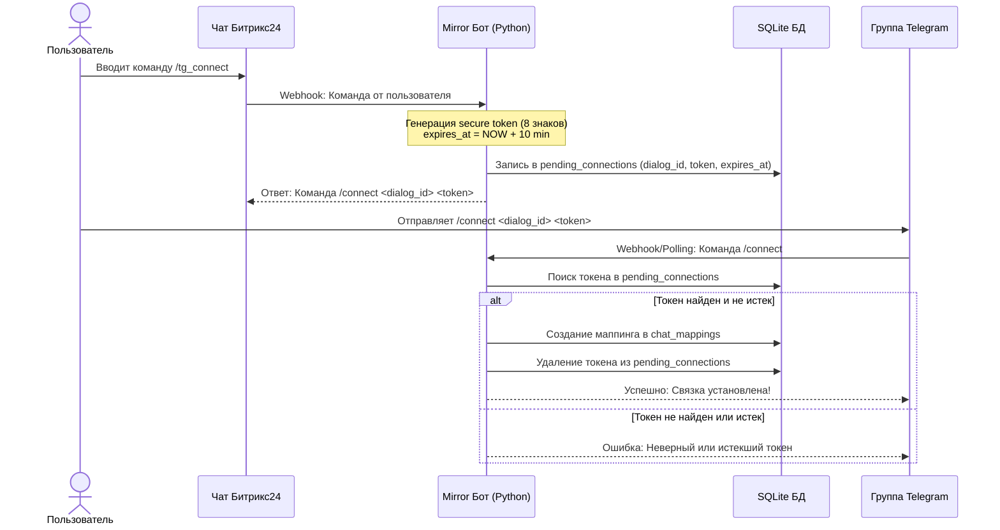

# Спецификация: Безопасное подключение чатов и система лимитирования (Rate Limiting)

Эта спецификация описывает архитектуру и дизайн изменений для безопасного самостоятельного подключения Telegram-групп к чатам Битрикс24 пользователями через систему одноразовых токенов, а также защиту сервиса от спама и взаимной блокировки чатов при высокой нагрузке (500+ чатов).

## 1. Архитектура и поток данных (Data Flow)

Ниже представлена схема двухэтапного подключения чата:



---

## 2. Изменения в схеме Базы Данных (SQLite)

Для хранения временных токенов авторизации создается новая таблица `pending_connections`.

```sql
CREATE TABLE IF NOT EXISTS pending_connections (
    id INTEGER PRIMARY KEY AUTOINCREMENT,
    bitrix_dialog_id TEXT NOT NULL,
    token TEXT NOT NULL UNIQUE,
    expires_at_unix INTEGER NOT NULL,
    created_at_unix INTEGER NOT NULL
);

-- Индекс для мгновенного поиска по токену
CREATE INDEX IF NOT EXISTS idx_pending_connections_token 
ON pending_connections(token);

-- Индекс для эффективной очистки просроченных записей
CREATE INDEX IF NOT EXISTS idx_pending_connections_expires 
ON pending_connections(expires_at_unix);
```

---

## 3. Спецификация компонентов

### 3.1. Безопасный процесс подключения (Secure Connection Flow)
- **Битрикс-команда `/tg_connect`**:
  - Бот перехватывает команду в Битриксе.
  - Автоматически очищает старый мусор: `DELETE FROM pending_connections WHERE expires_at_unix < current_time`.
  - Генерирует токен длиной 8 символов (комбинация `[a-zA-Z0-9]`).
  - Сохраняет токен и `bitrix_dialog_id` в БД.
  - Выдает инструкцию для Telegram.
- **Telegram-команда `/connect <BitrixChatId> <Token>`**:
  - Доступна обычным пользователям (если требуется дать им права самостоятельно настраивать зеркало).
  - Валидирует формат параметров.
  - Ищет запись по токену в БД. Если запись найдена и `expires_at_unix >= current_time`:
    - Регистрирует маппинг в `chat_mappings`.
    - Вызывает метод `reload_mappings()` в `MirrorService` для применения настроек без перезапуска.
    - Удаляет токен из `pending_connections`.

### 3.2. Поканальное лимитирование и изоляция (Per-channel Rate Limiting)
Для предотвращения DoS-атак одного чата на другие, глобальная очередь заменяется на изолированные очереди с механизмом **Leaky Bucket** (сглаживание нагрузки).

- **Архитектура очередей**:
  - Каждому активному `tg_chat_id` выделяется свой объект `asyncio.Queue` с фиксированным максимальным размером (`maxsize=100`).
  - При поступлении сообщения из Telegram, бот находит нужную очередь по `tg_chat_id`.
  - Если размер очереди превышает 100 сообщений:
    - Новые сообщения отбрасываются (drop) в памяти, лог пишется в `warning`.
    - Никакие уведомления о спаме в сам чат не отправляются (чтобы избежать дополнительного флуда).
- **Поканальный воркер отправки (Throttling Consumer)**:
  - Каждый канал обслуживается независимой корутиной-воркером.
  - Между отправками сообщений в Битрикс выдерживается обязательная пауза: **0.2 секунды** (максимум 5 сообщений в секунду).
  - Схема аналогично применяется для направления **Битрикс → Telegram** для защиты Telegram API.

### 3.3. Централизованный планировщик поллинга (Scalable Poll Scheduler)
Для поддержки 500+ чатов убирается индивидуальный поллинг каждого чата в отдельной бесконечной таске.

- **Служба `PollScheduler`**:
  - Работает в единственном экземпляре.
  - Управляет опросом через семафор параллельности: `asyncio.Semaphore(value=5)`.
  - Опрашивает чаты последовательно, гарантируя, что в любой момент времени выполняется не более 5 конкурентных запросов к Битриксу.
  - **Интеграция с Webhook**: при получении вебхука от Битрикса, целевой `dialog_id` мгновенно продвигается в начало очереди опроса для немедленной доставки.

---

## 4. Меры безопасности (Security & Performance)
- **Изоляция транзакций**: Все вызовы к SQLite выполняются в `asyncio.to_thread` и завершаются до начала любых внешних сетевых вызовов (HTTP REST API). Это гарантирует отсутствие блокировок SQLite (`database is locked`).
- **Срок действия токена (TTL)**: Строго 10 минут. Истекшие токены удаляются при каждой попытке создания нового подключения.
- **Предотвращение утечек**: Токен удаляется немедленно после первого использования (одноразовый токен).

---

## 5. План тестирования (Testing Plan)

1. **Unit-тесты для токенов**:
   - Тест генерации токена в Битриксе (запись в БД, корректный TTL).
   - Тест успешной активации токена в Telegram (создание маппинга, удаление токена).
   - Тест отклонения просроченного или неверного токена.
2. **Unit-тесты для лимитера (Rate Limiter)**:
   - Тест отправки 10 сообщений подряд: должны уходить с интервалом не менее 0.2 сек.
   - Тест переполнения очереди: при отправке 150 сообщений в секунду, первые 100 доставляются плавно, последние 50 отбрасываются, память не утекает.
3. **Интеграционный тест планировщика**:
   - Проверка ограничения параллельности при опросе 50+ чатов одновременно (не более 5 конкурентных запросов).
